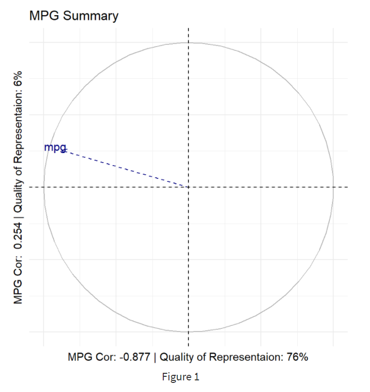
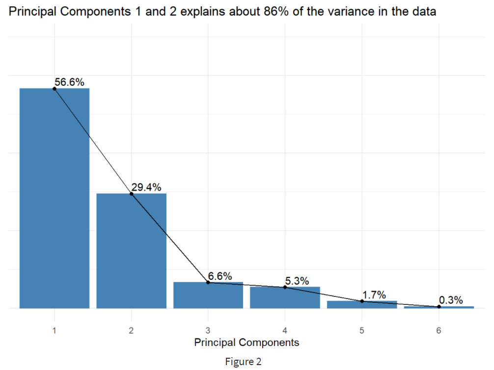
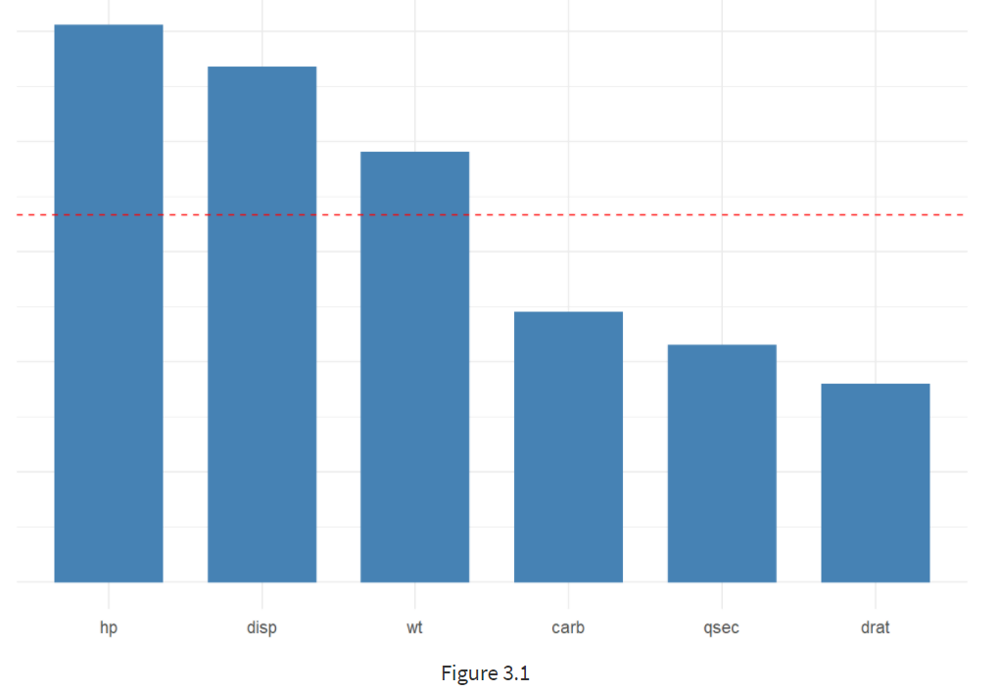
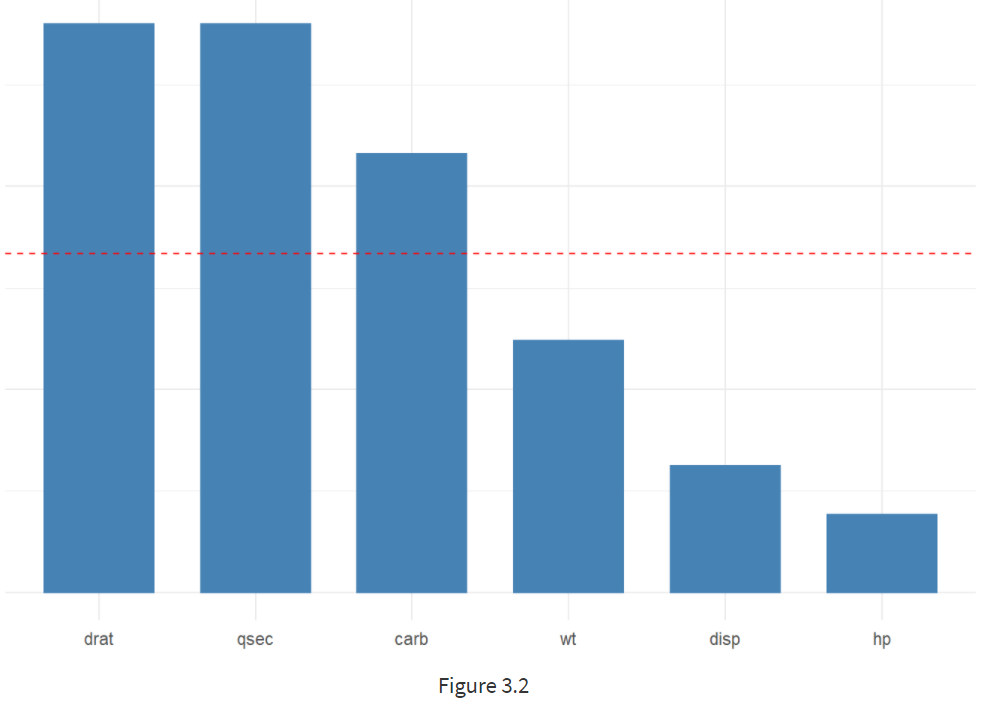
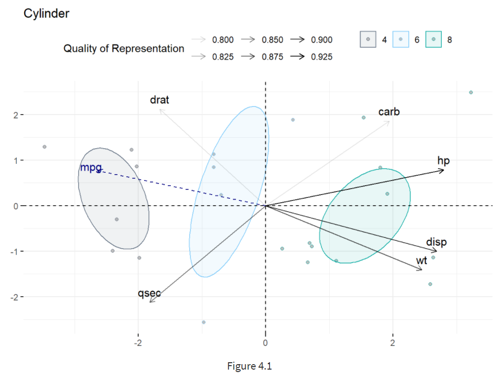
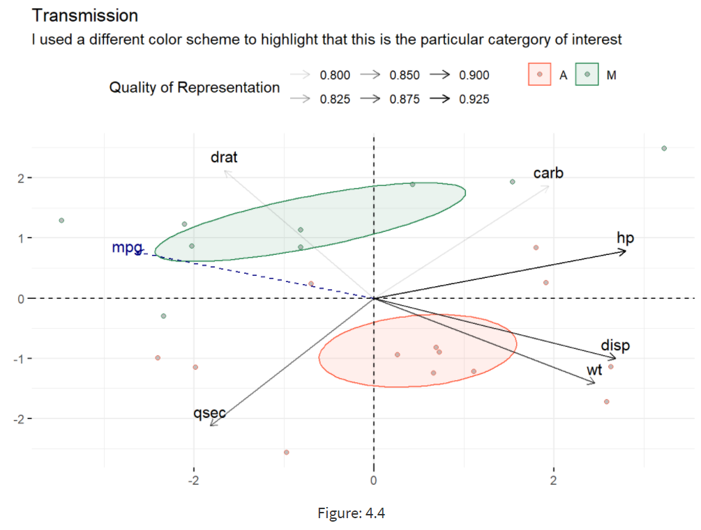

# Project Overview: 1974_Motor_Trends_Analysis
Observational and Inferential analysis of vehicles in 1974 (mtcars)

## Code Used
R | version
--- | --- 
dplyr      | version
ggplot2    | version
factoextra | version
FactoMineR | version
plotly     | version
broom      | version

## Business Requirement
1. Is an *automatic* or *manual* transmission better for mpg?
2. Quantify the **mpg** difference between automatic and manual transmissions.

## Data Collection
Feature | Description
--- | --- 
**mpg** | Miles / US Gallon
disp    | Displacement - Measures the overall volume in the engine as a factor of cylinder circumfrance, depth and total number of cylinders. ‘Proxy for the total amount of power the engine can generate.’ 
hp      |	Horsepower
drat    | Rear Axle Ratio - The number of turns of the drive shaft for every one rotation of the wheel axle
wt      |	Weight (lb/1000)
qsec    |	1/4 time - A performance measure, primarily of acceleration
vs      | Engine Cylinder Configuration - (VShape = 0 : StraightLine = 1)
am      | Transmission Type - (Auto = 0 : Manual = 1)
gear    | Number of Forward Gears - Auto = (3 : 4), Manual = (4 : 5)
carb    | Number of Carburetors - Engines with higher displacement typically have higher barrel configuration

## Data Cleaning

## EDA

## Model Build
To Quantify the difference I choose to use a Regresion Model because.

* I was able to get good most of the variance explanined 

* The error was low

* Highly Interpretable, which leads to producing Coeffiecents for Inferential Statistics

#### Final: Multiple Linear Regression Model
Intercept | am (Manual) | am (Automatic) | am:wt | Rsquared | RMSE
--- | --- |--- | --- | --- | ---
29.314 | 13.352 | -3.282 | -8.051 | 83% | 3.45

## Results
#### Is an *automatic* or *manual* transmission better for mpg?

* If your vehicle weighs below 2,500lb (2.5 * 1000). I would say go for the manual transmission because it has a better mpg.

* If the weight of a vehicle is above 2.500lbs there not much of a difference between manual and automatic

#### Quantify the **mpg** difference between automatic and manual transmissions.

 * According to the model Automatic Transmission vehicles have an avg mpg of 29.31. As weight increases by 1 unit (1000/lbs), for an Automatic vehicle the mpg will drop by -3.28

 * If the vehicle has a Manual Transmission the mpg increases by 13.35. As weight increases by 1 unit (1000/lbs), for a Manual vehicle the mpg will drop by -8.05
